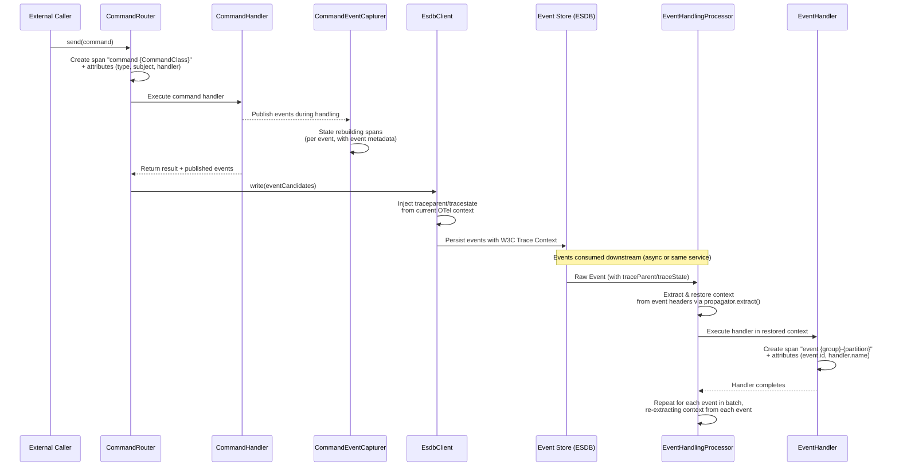
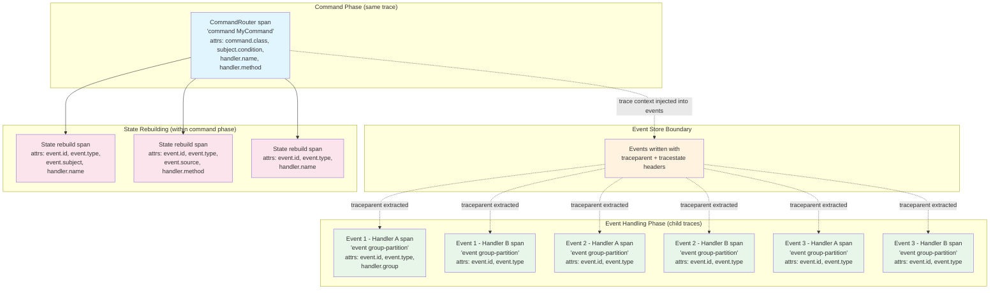
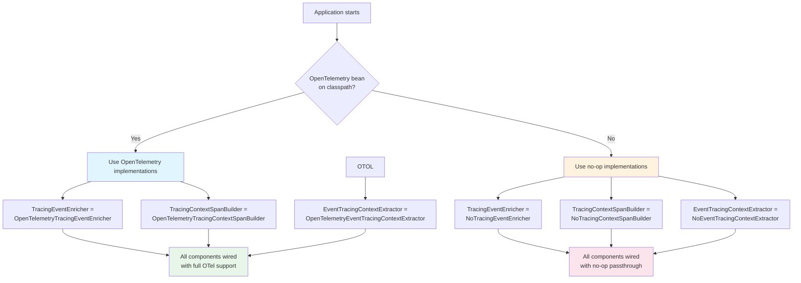
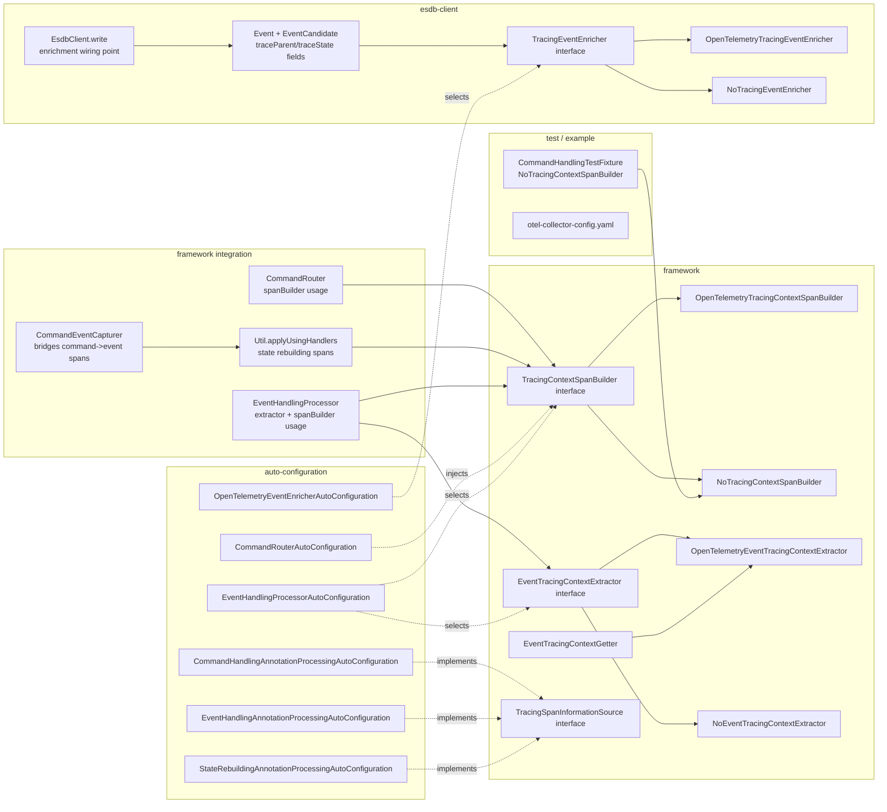

# OpenCQRS Tracing Analysis

## Overview

OpenCQRS implements a bidirectional W3C Trace Context propagation system using OpenTelemetry. The tracing architecture spans two core modules — `framework` and `esdb-client` — with Spring Boot auto-configuration glue in their respective `-spring-boot-autoconfigure` modules.

The system works in two directions:
- **Outward**: Trace headers (`traceparent`/`tracestate`) are injected into events before they are written to the event store, capturing the current OpenTelemetry context.
- **Inward**: When events are consumed by event handlers, the stored trace headers are extracted and restored into the thread-local OpenTelemetry context, so all subsequent spans become children of the original trace.

A circuit-breaker pattern ensures graceful degradation: full OpenTelemetry implementations are used when the `OpenTelemetry` bean is present on the classpath; otherwise, no-op alternatives are used automatically.

---

## Module-by-Module Breakdown

### 1. `esdb-client` — Event Enrichment (Outward Tracing)

**Package**: `com.opencqrs.esdb.client.tracing`

This module is responsible for injecting W3C Trace Context headers into events before they are persisted.

| Component | File | Purpose |
|-----------|------|---------|
| `TracingEventEnricher` (interface) | `esdb-client/.../tracing/TracingEventEnricher.java` | Contract: `enrichWithTracingData(EventCandidate) -> EventCandidate` |
| `OpenTelemetryTracingEventEnricher` | `esdb-client/.../tracing/OpenTelemetryTracingEventEnricher.java` | Uses `propagator.inject()` to populate headers from current OTel context. Preserves existing headers for forwarded chains. |
| `NoTracingEventEnricher` | `esdb-client/.../tracing/NoTracingEventEnricher.java` | Returns the candidate unmodified. |

**Wiring point**: `EsdbClient.write()` (line 138-140) maps each event candidate through `tracingEventEnricher::enrichWithTracingData` before writing to the store.

The `Event` and `EventCandidate` records include `traceParent` and `traceState` fields (W3C Trace Context standard).

### 2. `framework` — Core Tracing Abstractions (Inward Tracing + Span Building)

**Package**: `com.opencqrs.framework.tracing`

This module defines the core tracing interfaces and implementations used across command handling, event handling, and state rebuilding.

| Component | File | Purpose |
|-----------|------|---------|
| `TracingContextSpanBuilder` (interface) | `framework/.../tracing/TracingContextSpanBuilder.java` | Contract for creating spans around command/event handler execution. Supports `Runnable` and `Supplier` variants with optional post-processors for enriching span info after execution. |
| `OpenTelemetryTracingContextSpanBuilder` | `framework/.../tracing/OpenTelemetryTracingContextSpanBuilder.java` | Creates spans via `tracer.spanBuilder(name).startSpan()`, makes span current, runs logic, sets attributes including `handler.success` boolean, ends span. |
| `NoTracingContextSpanBuilder` | `framework/.../tracing/NoTracingContextSpanBuilder.java` | Pass-through: runs logic without creating spans. |
| `EventTracingContextExtractor` (interface) | `framework/.../tracing/EventTracingContextExtractor.java` | Contract: `extractAndRestoreContextFromEvent(Event, Runnable)` — restores W3C trace context from an event into thread-local OTel context. |
| `OpenTelemetryEventTracingContextExtractor` | `framework/.../tracing/OpenTelemetryEventTracingContextExtractor.java` | Uses `propagator.extract(Context.current(), event, textMapGetter).makeCurrent()` to restore context. |
| `NoEventTracingContextExtractor` | `framework/.../tracing/NoEventTracingContextExtractor.java` | Runs the Runnable without context restoration. |
| `EventTracingContextGetter` | `framework/.../tracing/EventTracingContextGetter.java` | Implements `TextMapGetter<Event>`. Maps `"traceparent"` and `"tracestate"` keys to event fields. |
| `TracingSpanInformationSource` (interface) | `framework/.../tracing/TracingSpanInformationSource.java` | Implemented by handlers to contribute span metadata: class name, full class name, method signature. |

### 3. `framework` — Command Handling Integration

**Package**: `com.opencqrs.framework.command`

| Component | File | Purpose |
|-----------|------|---------|
| `CommandRouter` | `framework/.../command/CommandRouter.java` | Constructor takes `TracingContextSpanBuilder`. Wraps entire command execution in a span via `executeSupplierWithNewSpan()`. Post-processor adds `"events.published"` count. Span attributes include command type, subject condition, sourcing mode, handler class/method info. |
| `Util.applyUsingHandlers()` | `framework/.../command/Util.java` | Wraps each state rebuilding handler invocation in a span. Span info includes event class, event ID/type/subject/timestamp/source, handler name/method. |
| `CommandEventCapturer` | `framework/.../command/CommandEventCapturer.java` | Holds `TracingContextSpanBuilder`. Passes it to `Util.applyUsingHandlers()` when events are published during command handler execution, so state rebuilding within the same thread also gets spans. |

### 4. `framework` — Event Handling Integration

**Package**: `com.opencqrs.framework.eventhandler`

| Component | File | Purpose |
|-----------|------|---------|
| `EventHandlingProcessor` | `framework/.../eventhandler/EventHandlingProcessor.java` | Has both `contextExtractor` and `spanBuilder`. For each batch of raw events: (1) extracts trace context from the event via `contextExtractor.extractAndRestoreContextFromEvent()`, (2) wraps each handler invocation in a span via `spanBuilder.executeRunnableWithNewSpan()`. Span info includes event ID/type/subject/timestamp/source, handler group/partition. |

### 5. Spring Boot Auto-Configuration

**Packages**: `com.opencqrs.framework.*` and `com.opencqrs.esdb.client.*` (in `-spring-boot-autoconfigure` modules)

The auto-configuration uses `@ConditionalOnBean(OpenTelemetry.class)` vs `@ConditionalOnMissingBean` to select implementations:

| Module | Auto-Configuration Class | Purpose |
|--------|--------------------------|---------|
| `framework-spring-boot-autoconfigure` | `EventHandlingProcessorAutoConfiguration` (line 481-502) | Registers `OpenTelemetryEventTracingContextExtractor` / `NoEventTracingContextExtractor` and `OpenTelemetryTracingContextSpanBuilder` / `NoTracingContextSpanBuilder`. |
| `framework-spring-boot-autoconfigure` | `CommandRouterAutoConfiguration` (line 31) | Injects whichever `TracingContextSpanBuilder` was selected. |
| `framework-spring-boot-autoconfigure` | `CommandHandlingAnnotationProcessingAutoConfiguration` (line 183) | `ReflectiveMethodInvocationCommandHandler` implements `TracingSpanInformationSource`. |
| `framework-spring-boot-autoconfigure` | `EventHandlingAnnotationProcessingAutoConfiguration` (line 203) | `ReflectiveMethodInvocationEventHandler` implements `TracingSpanInformationSource`. |
| `framework-spring-boot-autoconfigure` | `StateRebuildingAnnotationProcessingAutoConfiguration` (line 172) | `ReflectiveMethodInvocationStateRebuildingHandler` implements `TracingSpanInformationSource`. |
| `esdb-client-spring-boot-autoconfigure` | `OpenTelemetryEventEnricherAutoConfiguration` | Registers `OpenTelemetryTracingEventEnricher` bean (after OTel SDK auto-config). |
| `esdb-client-spring-boot-autoconfigure` | `NoTracingEventEnricherAutoConfiguration` (test) | Verifies no-op enricher is used when no OTel bean exists. |

### 6. `framework-test` — Test Support

**Package**: `com.opencqrs.framework.command`

| Component | File | Purpose |
|-----------|------|---------|
| `CommandHandlingTestFixture` | `framework-test/.../command/CommandHandlingTestFixture.java` (line 145) | Uses `NoTracingContextSpanBuilder` for all test scenarios, ensuring trace headers are not a confounding variable during tests. |

### 7. `example-application` — Example Configuration

| Component | File | Purpose |
|-----------|------|---------|
| OTel Collector Config | `example-application/otel-collector-config.yaml` | Example OTLP receiver on port 4318 with Zipkin exporter at `http://zipkin:9411/api/v2/spans`. |

---

## End-to-End Trace Flow

The complete trace lifecycle spans from command submission through event persistence to downstream event handling:

### Key Design Points

1. **Context extraction happens per-event**: Each raw event in a batch gets its trace context extracted and restored before handler execution. This means all spans created during that handler invocation become children of the original trace context stored on the event, not siblings under a batch-level span.

2. **Header preservation for forwarded chains**: If an event already has `traceParent`/`traceState`, the enricher preserves them rather than overwriting. This supports event forwarding scenarios where trace context should not be regenerated.

3. **State rebuilding gets its own spans**: When a command handler publishes events, state rebuilding handlers execute within the same thread and get their own spans with detailed event metadata (ID, type, subject, timestamp, source).

4. **Post-processor enrichment**: The command router's span uses a post-processor to add `"events.published"` count after the handler completes, since this value is only known at the end.

---

## Span Hierarchy Example

For a command that triggers 3 events, each handled by 2 event handlers:

---

## Auto-Configuration Selection Logic

The Spring Boot auto-configuration uses a conditional bean selection pattern:

---

## Span Attributes Reference

### Command Router Spans

| Attribute | Source | Example Value |
|-----------|--------|---------------|
| `span.name` | Constructed | `"command MyCommand"` |
| `command.class` | Command type | `"com.example.CreateOrder"` |
| `command.subject.condition` | Subject condition | `"order:123"` |
| `command.sourcingmode` | Sourcing mode | `"SOURCED"` / `"NONE"` |
| `instance.class` | CommandRouter instance | `"com.opencqrs.framework.command.CommandRouter"` |
| `handler.class` (via TracingSpanInformationSource) | Handler class name | `"com.example.CreateOrderHandler"` |
| `handler.method` (via TracingSpanInformationSource) | Handler method signature | `"handle(CreateOrder)"` |
| `events.published` (post-processor) | Event count after execution | `"3"` |
| `handler.success` | Exception handling | `"true"` / `"false"` |

### Event Handler Spans

| Attribute | Source | Example Value |
|-----------|--------|---------------|
| `span.name` | Constructed | `"event orders-0"` |
| `event.id` | Event metadata | `"550e8400-e29b-41d4-a716-446655440000"` |
| `event.type` | Event metadata | `"com.example.OrderCreated"` |
| `event.subject` | Event metadata | `"order:123"` |
| `event.timestamp` | Event metadata | `"2026-05-08T10:30:00Z"` |
| `event.source` | Event metadata | `"com.example.CreateOrder"` |
| `handler.group` | Event group | `"orders"` |
| `handler.partition` | Event partition | `"0"` |
| `handler.class` (via TracingSpanInformationSource) | Handler class name | `"com.example.OrderCreatedHandler"` |
| `handler.method` (via TracingSpanInformationSource) | Handler method signature | `"on(OrderCreated)"` |
| `handler.success` | Exception handling | `"true"` / `"false"` |

### State Rebuilding Spans

| Attribute | Source | Example Value |
|-----------|--------|---------------|
| `span.name` | Constructed | `"state sourcing"` / `"state update"` |
| `event.class` | Event type | `"com.example.OrderCreated"` |
| `event.id` | Event metadata | UUID string |
| `event.type` | Event metadata | Full class name |
| `event.subject` | Event metadata | Subject string |
| `event.timestamp` | Event metadata | ISO timestamp |
| `event.source` | Event metadata | Originating command class |
| `instance.class` | State rebuilding handler instance | Handler class name |
| `handler.class` (via TracingSpanInformationSource) | Handler class name | `"com.example.OrderStateRebuilder"` |
| `handler.method` (via TracingSpanInformationSource) | Handler method signature | `"rebuild(OrderCreated)"` |
| `handler.success` | Exception handling | `"true"` / `"false"` |

---

## Module Dependency Graph (Tracing)

---

## Summary

| Aspect | Detail |
|--------|--------|
| **Standard** | W3C Trace Context (`traceparent`/`tracestate`) |
| **Runtime** | OpenTelemetry Java SDK (auto-detected via Spring Boot auto-config) |
| **Modules with tracing code** | `esdb-client`, `framework` (core logic); `-spring-boot-autoconfigure` modules (glue) |
| **Modules without tracing code** | `framework-test`, `example-application` (use framework classes transitively) |
| **Injection points** | `EsdbClient.write()` (outward), `CommandRouter.send()` (command span), `EventHandlingProcessor` (inward extraction + handler spans), `Util.applyUsingHandlers()` (state rebuilding spans) |
| **Handler metadata** | `TracingSpanInformationSource` interface implemented by all reflective handler types in Spring Boot auto-config |
| **Graceful degradation** | No-op implementations used when OpenTelemetry is absent from classpath |
| **Test support** | `CommandHandlingTestFixture` uses no-op span builder for deterministic tests |
| **Example config** | OTel collector with Zipkin exporter in `example-application/` |
