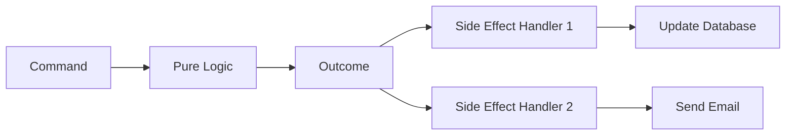
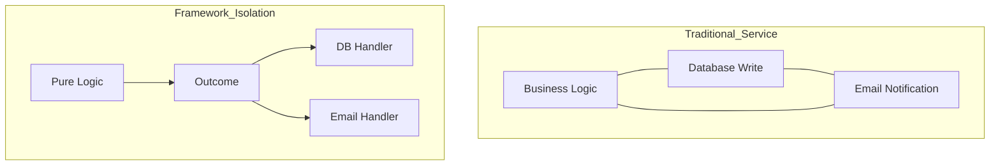

# CQRS: Reducing Mental Load through the Isolation of Side Effects

Software development often feels like a constant battle against complexity. You start with a simple service, but it quickly evolves into a "fat" class that handles everything from validation to database writes. This entanglement leads to cognitive overload and fragile code.

<!-- more -->

I believe the solution lies in **cognitive ergonomics**. CQRS is not just a pattern for scaling databases, but a tool for simplifying the developer's mind. It works by drawing strict lines where other architectures allow blur.

In this first part of the series, I will introduce you to these core concepts. We will move from basic definitions to a powerful model of isolation. These principles are the foundation of any robust CQRS framework, including OpenCQRS.

## The Basic Split (Commands vs. Queries)

The term CQRS stands for Command Query Responsibility Segregation. At its simplest, it means you separate the act of asking for data from the act of changing it. Every interaction with your system fits into one of these two categories.

A **Query** is a request for information that never modifies the system state. In a library application, this could be searching for a book title in the catalog. It is a read-only operation with no side effects.

A **Command** is an intent to change the state of the system. Loaning a book or returning one are classic examples of commands. They represent a request for the system to perform an action.

This split solves a hidden problem I call the "output trap". A mobile app might only need a green checkmark after a loan, while a librarian needs full user details. By separating the command from the query, you avoid bloated methods that try to return everything to everyone.

## The Logic/Effect Divide

To truly unlock the power of this architecture, you must go beyond the basic split. You need to isolate your business logic from your side effects. I define **pure logic** as a decision-making process stripped of execution.

A pure decision takes an input and produces an outcome without actually changing anything. It does not write to a database or send an email. It simply decides what should happen based on the rules.

**Side Effects** are the "how" of your system. They handle the actual execution, such as updating a record or triggering an API call. These should live in discrete handlers, completely separate from the logic.

This separation reduces your mental load significantly. You no longer have to worry about database transactions while you are refining a business rule. You simply focus on the decision, then trust the handlers to execute it.

## The Conceptual Flow

Let us apply this flow to our book loan example. Everything starts with a command to loan a specific book to a user. This request enters the system as a simple intent.

Next, the system invokes the pure logic phase. It checks if the book is available and if the user has any overdue fines. The result of this phase is a simple outcome, such as "Loan Approved".

Finally, the system triggers the isolated side effects. One handler updates the book status in the database to "loaned". Another handler sends a confirmation email to the user.

This linear progression turns a complex process into a predictable sequence. You move from intent to decision and finally to action. This clarity is the foundation of a maintainable framework.

## The Developer's Dividend

Contrast this approach with the traditional "fat service" model. In that world, you often have to mock a database just to test if a business rule works. This makes your tests slow and fragile.

Testing pure logic is an entirely different experience. You provide inputs and assert outputs without any infrastructure involved. Your tests become lightning fast and completely reliable.

Debugging also becomes a trivial task. If an email is not being sent, you know exactly which side effect handler to check. You no longer hunt for a hidden bug inside a massive, intertwined method.

This isolation is particularly valuable in a **[modulith](https://example.com/modulith)** architecture. You can evolve your infrastructure without risking the core business rules. Your mental energy is spent on creating value rather than fighting plumbing.

## Conclusion

CQRS is more than an architectural pattern; it is a strategy for managing complexity. By separating commands from queries and logic from effects, you remove the entanglement that causes bugs. You shift your focus toward cognitive ergonomics.

I encourage you to start thinking of your business logic as a decision engine. Stop mixing the "what" with the "how". Your future self will thank you for the reduced mental load.

This was only the beginning of our journey into CQRS building blocks. In the next part, we will move from these concepts to concrete architecture. We will explore the specific components a framework needs to provide and see how those are modeled in OpenCQRS.
